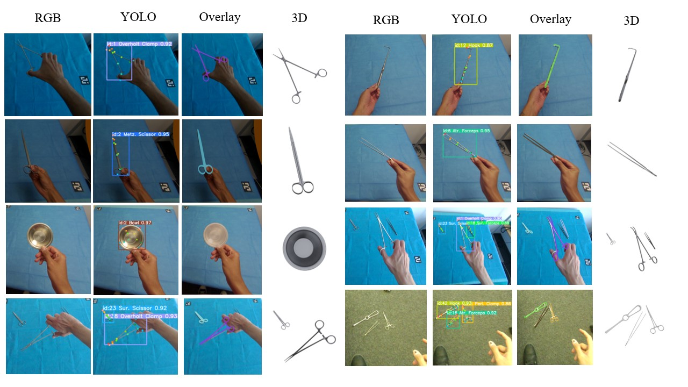

# [GCPR 2024] SurgeoNet: Realtime 3D Pose Estimation of Articulated Surgical Instruments using a Synthetically-trained Network ([PDF]())
<!-- ## Overview -->
> Authors: **Ahmed Tawfik Aboukhadra, Nadia Robertini, Jameel Malik, Ahmed Elhayek, Gerd Reis, Didier Stricker**  
> Group: **DFKI-AV**


This repo contains the training and testing code of SurgeoNet as described in our paper. SurgeoNet is a 3D pose estimator for articulated surgical instruments that contains a YOLOv8 and Transformer networks. Both networks where trained on synthetic data. To the best of our knowledge, our method is the first to estimate 7DoF for surgical instruments that contain an articulation angle e.g. surgical scissors.

<!--  -->
<p align="center">
    
</p>

We provide pretrained networks that can be directly used for inference. In addition, we provide the annotated synthetic data that were used for training along with real data that was captured by a Varjo XR headset for qualitative evaluation purposes. All models and data can be found on our [DFKI cloud](https://cloud.dfki.de/owncloud/index.php/s/YwtRc7MtLdzF8GR).

## Installation

1) We recommend creating a virtual environment using conda

```
conda create --name surgeonet python=3.10
conda activate surgeonet
```

2) Install Dependencies

```
pip install torch torchvision torchaudio --index-url https://download.pytorch.org/whl/cu118
pip install requirements.txt
```

## Inference

We provide 4 pretrained YOLOv8 models for surgical instruments detection and keypoint estimation which differ in model size and resolution.  
All the YOLO models can be downloaded [here](https://cloud.dfki.de/owncloud/index.php/s/riEoQMcP24k4Ca4) and should be unzipped inside the yolo subdirectory.  
The structure should be `SurgeoNet/yolo/runs/pose/{model_size}_{resolution}`.  
Each model comes in 2 formats: PyTorch `.pt` file and TensorRT `.engine` file.  
This can be controlled using the `--model_extension` parameter in the scripts.  
> In general, the TensorRT format is faster, however, it could give weird outputs if there is a mismatch in the ultralytics and tensorrt libraries.

If you care more about accuracy than speed, use the m model with 1152 resolution. If not, then use the s model with 640 resolution.  
This can be easily configured in the inference script using the `--model` and `--resolution` parameters.  
Those parameters are shared for both the following cases scripts

**A)** If you only want to run YOLO's inference on monocular-RGB sequences:

We provide 4 RGB sequences captured by Varjo XR headset and are stored as png files that can be downloaded from [here](https://cloud.dfki.de/owncloud/index.php/s/DbFfwyQJgc4dYb7).  
To run YOLO on an RGB sequence or a directory that contains a list of RGB images:

Change the `--data_root` path in `yolo/test.sh` and run

```
cd yolo
bash test.sh  
```

**B)** If you want to run the full 3D pose estimation on stereo-RGB sequences:

We provide the same previous 4 RGB sequences captured by the Varjo XR headset but in stereo pairs and are stored as binary files that can be downloaded from [here](https://cloud.dfki.de/owncloud/index.php/s/XjXHyWsQ8Kr6HeD).  
If you have your own stereo frames, then you just need to change the `--data_root` parameter and the Preprocessor class found in utils.preprocessor along with its readPair function to read from your directory of stereo frames.  
The pretrained PyTorch Transformer comes with the repo at `transformer/transformer.pth`.

If you download a sequence from the provided sequences then  
1) unzip the sequence inside the `data/varjo_stereo/` directory  
2) change the `--data_root` parameter in the `inference.sh` script to the path of the unzipped folder
3) `bash inference.sh`

If you specify the `--visualize` flag you can see the YOLO outputs while running inference.  
If you specify the `--save` flag, all results (YOLO and Pose i.e. Projected Meshes) get exported to `output/yolo_transformer/{sequence_name}/`.  
`--save_objs` is another flag that exports `.obj` files that contain the 3D meshes. This exports large files so make sure that you need it and have the storage for it.


## Training

We provide our synthetic datasets in case you would like to retrain the entworks with different configurations.  

**A)** Train YOLO:  
We provide an RGB synthetic dataset of surgical instruments and their 2D keypoints in YOLO format [here](https://cloud.dfki.de/owncloud/index.php/s/ZDgELm79xmawM8H).  
You can train a new version of YOLO by changing the `yolo/train.py` script and you can change the dataset or dataset configurations in `yolo/surgical.yaml`.  
Make sure that your dataset is in [YOLO format](https://docs.ultralytics.com/datasets/pose/#ultralytics-yolo-format).  
To train you can the simply run: 
```
cd yolo
python3 train.py
```
This will likely take some time to complete (hours-days) depending on the dataset size, number of epochs, and batch size (limited by the GPU memory capacity).  


**B)** Train Transformer:

We provide a synthetic dataset that contains stereo 2D keypoints of surgical instruments and there corresponding 7 DoF pose annotations.  
You can train a new transformer on this dataset with your specific configurations.  

1) Download the synthetic dataset for transformer from [here](https://cloud.dfki.de/owncloud/index.php/s/BTqBdy6FLdKXxjP)
2) Unzip it inside the `data/` directory
3) Configure your network and options in `transformer.sh`
4) `bash transformer.sh`
5) Training will save checkpoints in `checkpoints/{experiment_name}/{epoch}.pth`
6) You can load a specific checkpoint by specifiying `--start_epoch` or test it by adding the `--test` flag and removing the `--train` flag.


<!-- ## Acknowledgments -->

## Citation

```
@InProceedings{
}
```